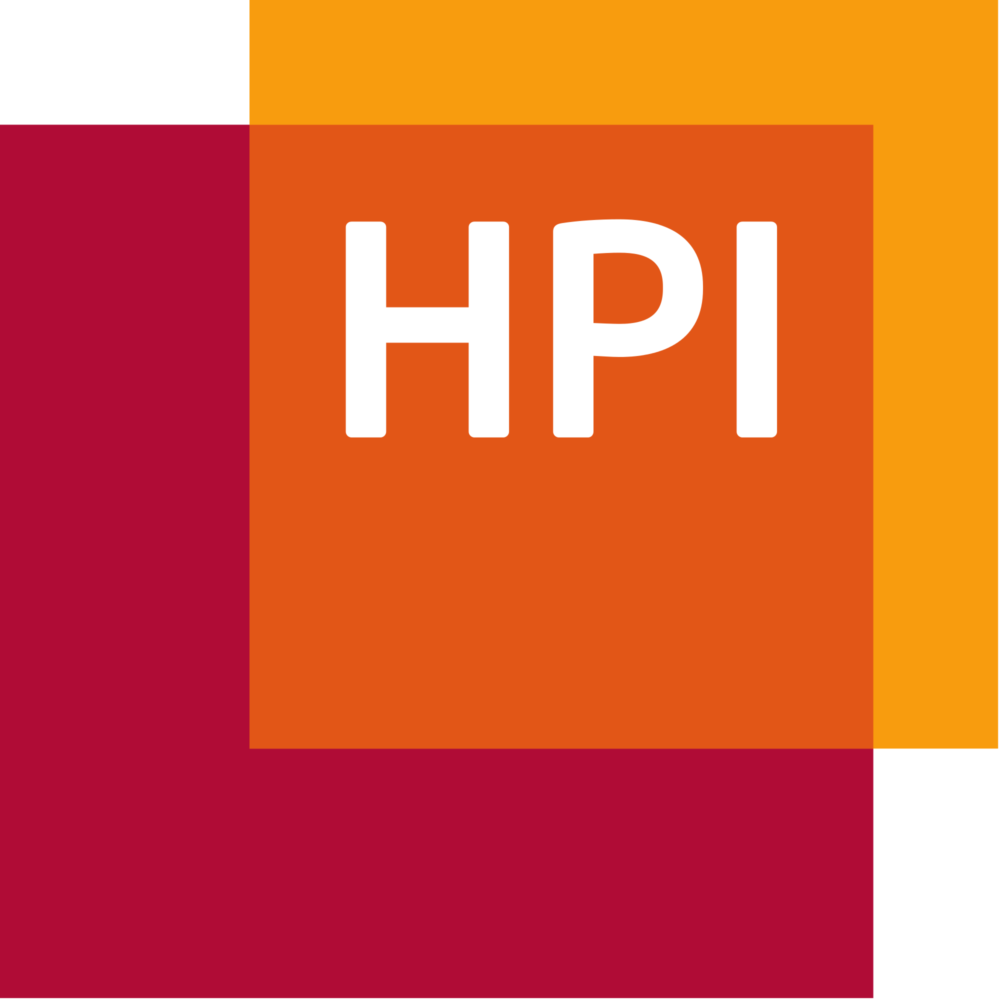
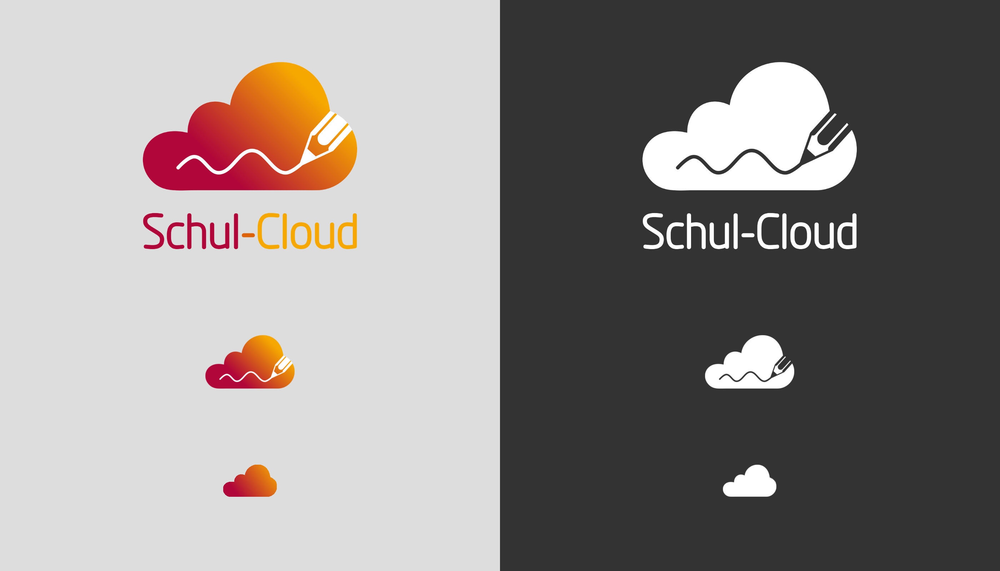

# Logo

## Intention

Unser Logo setzt sich aus 3 Bereichen zusammen.

1. Die Wolke, welche offensichtlich den Begriff "_Cloud_" der Schul-Cloud symbolisiert.
2. Den schreibenden Stift, welcher den Bezug zur Schule herstellen soll
3. und dem Farbverlauf, welcher eine abstrahierte Form des HPI-Logos  darstellt und somit den Bezug zum HPI erhält, welches die Schul-Cloud entwickelt.

## Versionen

Es existieren verschiedene Versionen des Schul-Cloud Logos. Generell gelten die folgenden Richtlinien:


Verwende die _normale_-Version auf hellen \(weißen\) Hintergründen und die _mono_-Version auf dunklen Hintergründen.



Verwende die Version mit Text nur, wenn ausreichend Platz vorhanden ist und das Logo groß genug dargestellt wird, sodass der Schriftzug mindestens so groß ist wie der Text drumherum.


