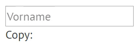

# Components & Snippets

## Server Side \(Handlebars & Controller\)

### Tabellen

## Client Side \(`/static/...`\)

### Linking Inputs

Du kannst Textfelder automatisch mit Texten aus Inputfeldern füllen lassen. Füge dazu einfach die `class="linked"` zu der Quelle hinzu und bei den jeweiligen Zielobjekten \(beliebig viele\) den entsprechenden Namen \(`data-from="[name]"`\) des input-Felds.



```javascript
import 'static/scripts/helpers/inputLinking';
```





```markup
<input class="linked" name="firstname" type="text" placeholder="Vorname"/>
<p data-from="firstname"></p>
```





### Konfetti Mode



```javascript
import 'static/scripts/confetti/confetti.js';
```





```markup
<div class="confetti-wrapper">
    ...
</div>
```




