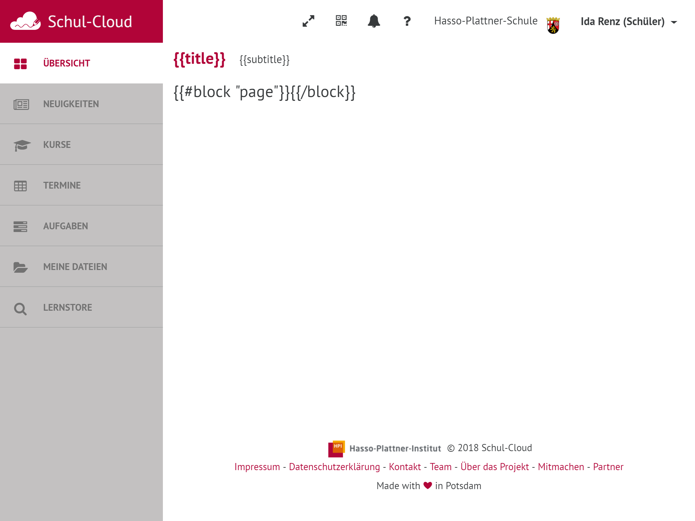
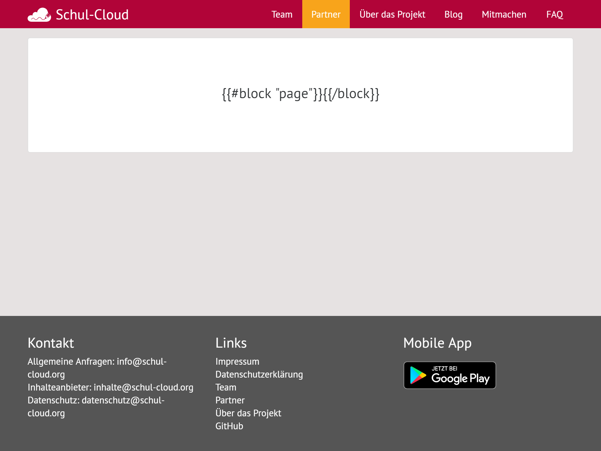
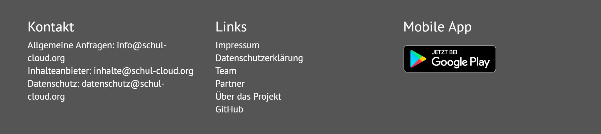
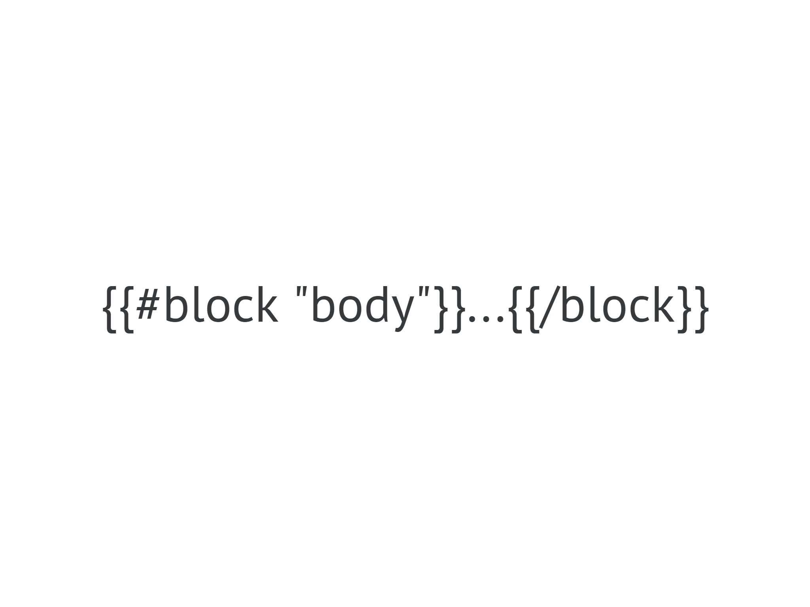
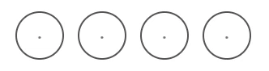

# Handlebars Components

## Page Templates

Für das erstellen von Seiten stehen die folgenden Templates zur Verfügung, welche über `extend` erweitert werden können.

```markup
{{#extend "lib/loggedin"}}
    {{#content "page"}}
        <h1>Hi</h1>
    {{/content}}
{{/extend}}
```




Sollte für alle Seiten genutzt werden, welche der Nutzer in eingeloggtem Zustand sehen kann.







Sollte für alle Seiten genutzt werden, für welche kein Login notwendig ist.




### Parameter

| Parameter | Werte \(default\) | Effekt |
| :--- | :--- | :--- |
| hideMenu | true/\(false\) | Beeinflusst die Sichtbarkeit des Menüs oben rechts. |
| hideFooter | true/\(false\) | Blendet den Footer ein/aus |
| extendedFooter | true/\(false\) | Auswahl zwischen simplen und komplexem Footer |







So selten wie möglich verwenden und nur wenn es nicht anders geht. Dieses Template dient prinzipiell nur als Grundlage für weitere Templates.


Dieses Template ist so minimalistisch wie möglich gehalten und bindet lediglich Schul-Cloud spezifische Schriftarten, Meta-Tags und base-styles ein.





Alle Templates beinhalten die Blöcke scripts und styles welche jeweils um die Seitenspezifischen Tags erweitert werden können.



```markup
{{#content "styles" mode="append"}}
    <link rel="stylesheet" href="/styles/authentication/home.css"/>
{{/content}}
```




Verwende defer an script-Tags um das rendering nicht zu blockieren. [Mehr Infos](https://developer.mozilla.org/en-US/docs/Web/HTML/Element/script#attr-defer).


```markup
{{#content "scripts" mode="append"}}
    <script src="/scripts/loggedin.js" type="text/javascript" defer></script>
{{/content}}
```



## Komponenten

### Tabellen


TODO


### Pagination


TODO


### Modals


TODO


### MultiPage-Form


TODO


### Pin Input

```markup
{{#embed "registration/pin" 
    digits=4 
    pattern="[0-9]"
    required="true" 
    name="email-pin" 
    class="mail-validation"
    }}{{/embed}}
```



## Handlebars Helper

[GitHub Source File](https://github.com/schul-cloud/schulcloud-client/blob/master/helpers/handlebars/helpers/index.js)

