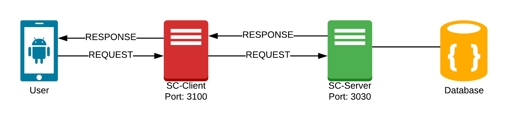
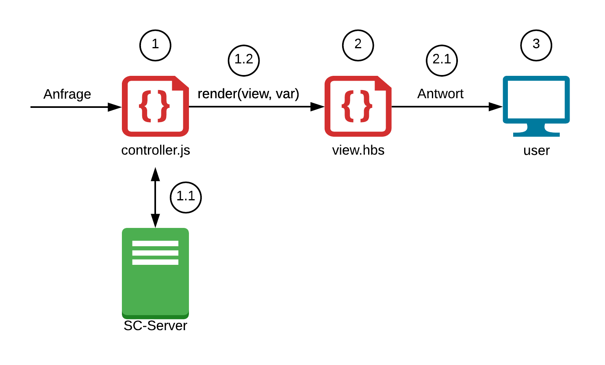

# Getting started

## Setup

* [Windows](https://schul-cloud.github.io/blog/2017-05-18/setup-schul-cloud-client-and-sever-under-windows)
* [Ubuntu](https://schul-cloud.github.io/blog/2017-04-21/setup-development-under-ubuntu)

## Architektur

Der Schul-Cloud Client benötigt grundsätzlich 3 Teile, den Client, den Server und die Datenbank. Der Server  kümmert sich dabei um die Kommunikation mit der Datenbank und stellt die Daten über eine REST-API den verschiedenen Schul-Cloud Anwendungen bereit.



Wird vom User eine Anfrage gestellt, so wird diese folgendermaßen vom Schul-Cloud Client verarbeitet.

### Anfrageverarbeitung



#### 1. Controller

Der Controller definiert verschiedene Routen, welche vom user angefragt werden können. Beispielhaft wird hier die Route für die Newsübersicht definiert.



```javascript
router.get('/', function (req, res, next) {
    // create response here
});
```



Jeder Controller benötigt damit er funktioniert jedoch noch etwas zusätzlichen Code, welcher importiert werden muss. Das ganze sieht dann so aus:



```javascript
const express = require('express');
const router = express.Router();
const authHelper = require('../helpers/authentication');

// Alle nachfolgenden Routen sind nur für eingelogte Benutzer sichtbar
router.use(authHelper.authChecker); 

// Routen Definitionen
router.get('/', function (req, res, next) {
    // create response here
});

module.exports = router;
```



Zusätzlich muss der Controller noch registriert werden. Dafür einfach in der `/controllers/index.js` einen Eintrag hinzufügen.



```javascript
router.use('/news', require('./news'));
```



Betrachten wir nun die Logik für die Route, so ist der Controller dafür verantwortlich alle Daten, welche zur Darstellung der Angeforderten Seite benötigt werden, zu besorgen. Er kann dazu Anfragen an den Server stellen \(1.1\) und die Daten aufbereiten.



```javascript
router.get('/', function (req, res, next) {
    api(req).get('/news/')
    .then(news => {
        // handle data
    });
});
```



Mehr Details, wie Daten vom Server gelesen werden können werden später auf einer extra Seite erläutert.



Im letzten Schritt müssen die Daten jetzt nur noch an die jeweilige view übergeben werden \(1.2\). Die View kümmert sich um die Umwandlung der übergebenen Variablen in HTML-Code. Hier wird die View `/views/news/overview.hbs` genutzt. Die Render-Funktion erwartet als 1. Parameter den Pfad zu einer `.hbs`-Datei \(Dateiendung und `/views` wird weggelassen\) und als 2. Parameter kann ein JSON-Objekt mit variablen übergeben werden, welche anschließen in der Handlebars Datei genutzt werden können.



```javascript
router.get('/', function (req, res, next) {
    api(req).get('/news/')
    .then(news => {
        // news = {total: 4, data: [{...}, {...}, ...]}
        news = news.data
        // news = [{title: '...', content: '...'}, ...]
        res.render('news/overview', {
            title: "Newsübersicht", 
            news: news // or shortly just: news
        });
    });
});
```




Bei der Übergabe von Variablen in der Render-Funktion kann statt `news: news` auch kurz `news` geschrieben werden, wenn key & value gleich benannt sind.


#### 2. View

Für unsere Views verwenden wir [Handlebars](https://handlebarsjs.com/) als Template Engine. Diese ermöglicht es uns, in das HTML die Variablen einzubinden und die HTML-Dateien Modular wiederzuverwenden.

Für unsere Newsübersicht, welche nur für eingeloggte Nutzer sichtbar sein soll erweitern wir einfach das Template für eingeloggte Benutzer \(welches es schon gibt\).



```markup
{{#extend "lib/loggedin"}}
    <!-- Wir können auch CSS Dateien einbinden -->
    {{#content "styles" mode="append"}}
        <link rel="stylesheet" href="/styles/news/news.css"/>
    {{/content}}
    <!-- JS geht auch -->
    {{#content "scripts" mode="append"}}
        <script src="/scripts/news/news.js" defer></script>
    {{/content}}
    <!-- Hier geht der eigentliche Inhalt los -->
    {{#content "body"}}
        {{#each news}} <!-- Füge für jede News folgendes ein: -->
            <h1>{{this.title}}</h1> <!-- Titel der News -->
            <p>{{this.content}}</p> <!-- Inhalt der News -->
        {{/each}}
    {{/content}}
{{/extend}}
```



Mit {{\#content "name"}} können vordefinierte Blöcke im zu erweiternden Template gesetzt/erweitert werden. Dadurch werden alle CSS & JS Dateien im fertigen Code an nur einer Stelle eingebunden und der Inhalt \("body"\) an der richtigen Stelle im Template gesetzt. Mehr dazu findet man in der [Handlebars Dokumentation](https://handlebarsjs.com/). Welche Templates und Komponenten es bereits gibt ist auf einer eigenen Seite festgehalten.



Allgemein kann mit `{{var}}` dynamischer Inhalt eingebunden werden. Dies können die übergebenen Variablen, aber auch verschiedene Helper sein. Wir haben die von Handlebars integrierten Hilfsfunktion \(`if`, `each`, ...\) um einige eigene erweitert. Diese sind unter `/helpers/handlebars/helpers/index.js` zu finden.

Im letzten Schritt parst der Client nun das angegebene Template und sendet alle Dateien an den User \(2.1\).

#### 3. Der User bekommt die entsprechende Seite dargestellt 😊

